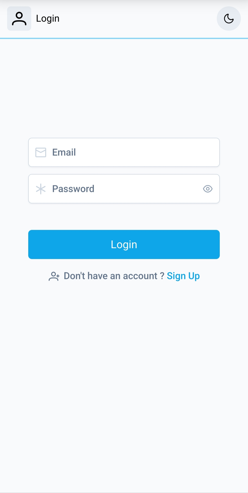
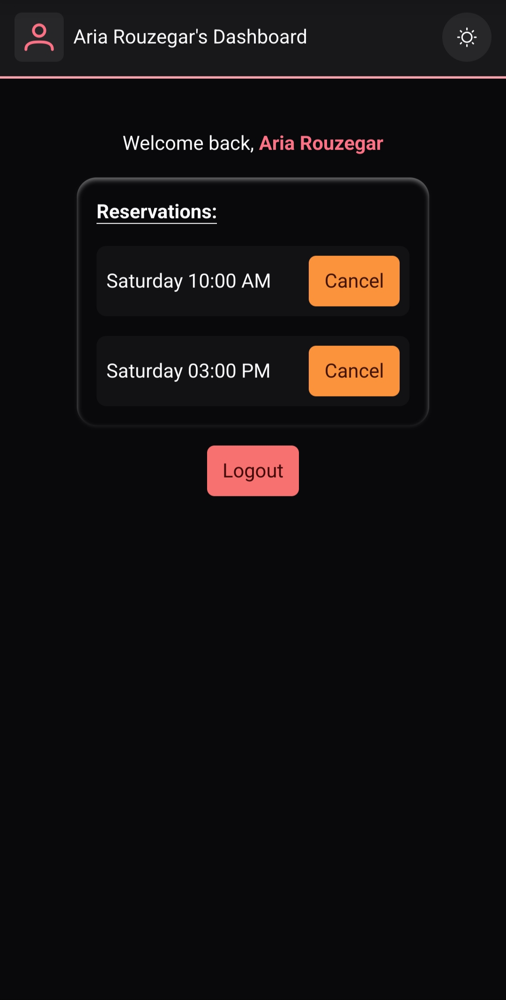
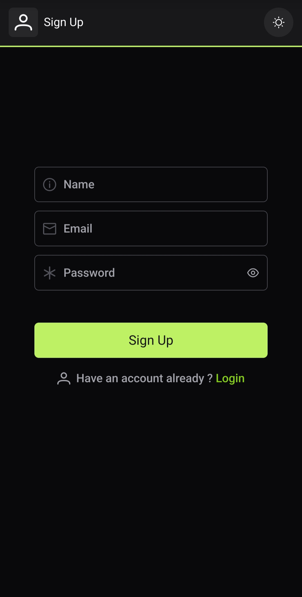

# Reservation Dashboard

A **secure, modern, and fully responsive dashboard** for managing reservations, built with Vue.js, Pinia, and Tailwind CSS.  
Allows signup/login, time-slot reservations, and unique booking enforcement — all without a backend.

Live Demo: [https://ariarzg-reservation-dashboard.netlify.app/](https://ariarzg-reservation-dashboard.netlify.app/)

---

## Features

- Responsive Design for mobile, tablet, and desktop
- Dark Mode Toggle
- Modern, intuitive UI
- Sign Up / Login / Logout functionality
- Password Encryption using bcrypt
- Unique User IDs with UUID v4
- Smart state management with Pinia
- Reservation system with one-time slot booking per account

---

## Technologies Used

- **Frontend:** Vue.js, Vue Router, Pinia, PrimeVue, Tailwind CSS
- **Authentication & Security:** bcrypt (password hashing), UUID v4 (unique user IDs)
- **Storage:** LocalStorage (data persistence)
- **Backend:** None

---

## Screenshots / Demo Preview

_Add your screenshots or GIFs in this section to visually showcase the project_

**Example:**

| Login / Signup                               | Dashboard View                                       | Dark Mode                                            |
| -------------------------------------------- | ---------------------------------------------------- | ---------------------------------------------------- |
|  |  |  |

---

## About This Project

The **Reservation Dashboard** is a modern, responsive web application designed to simulate a real-world reservation system. I built this project to strengthen my skills in Vue.js, state management with Pinia, and front-end development practices.

It allows users to sign up, log in, and make reservations, ensuring that each time slot can only be booked by one account. Even though the project doesn’t use a backend, I implemented secure authentication using bcrypt for password encryption and unique user IDs with UUID v4, storing all data safely in the browser’s localStorage.

A key focus was on user experience: the dashboard features a clean, modern design with dark mode, intuitive interactions, and responsive layouts across mobile, tablet, and desktop. The project demonstrates problem-solving by handling reservation conflicts, enforcing unique bookings, and maintaining state effectively — all while simulating a production-ready system on the front end.

This project highlights my ability to create a full-featured, secure, and visually appealing application, emphasizing both technical skills and thoughtful design.

---

## Getting Started

Follow these steps to run the project locally:

```bash
# Clone the repository
git clone https://github.com/Ariarzg/vue-user-dashboard-with-reservation.git
cd reservation-dashboard

# Install dependencies
npm install

# Run the development server
npm run dev
```

Open your browser at http://localhost:5173 to view the app.

---

## License

This project is for personal showcase purposes.
